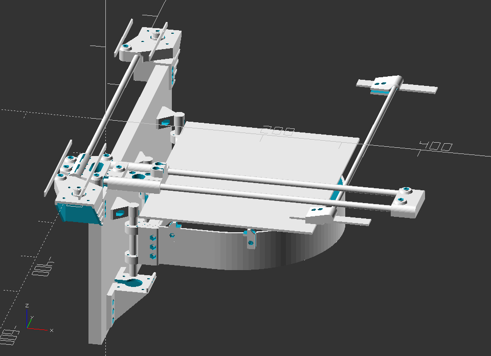

# Wilbur - a Core-XY arm printer

# BOM

## 15mm Linear Slide

Acquired from Adafruit

- 500mm x 15mm x 15mm
- Between Holes: 60mm
- Mounting Hole Diameters: 4.2mm
- Weight: 726g

## 15mm Diameter Linear Bearing Pillow Block

Acquired from Adafruit

- 60mm x 47mm (perpendicular x parallel)
- 15mm linear slide
- 194g
- M4 screw holes, 34mm x 26mm apart
  - 34mm apart in perpendicular to linear motion
  - 26mm apart in parallel to linear motion

## SC8UU Linear Bearing Platform

Acquired from Adaruit (aka 6061)

- 34mm x 30mm (perpendicular x parallel)
- 8mm rod slide
- 56g
- M4 screw holes, 24mm x 18mm apart
  - 24m apart in perpendicular to linear motion
  - 18mm apart in parallel to linear motion

